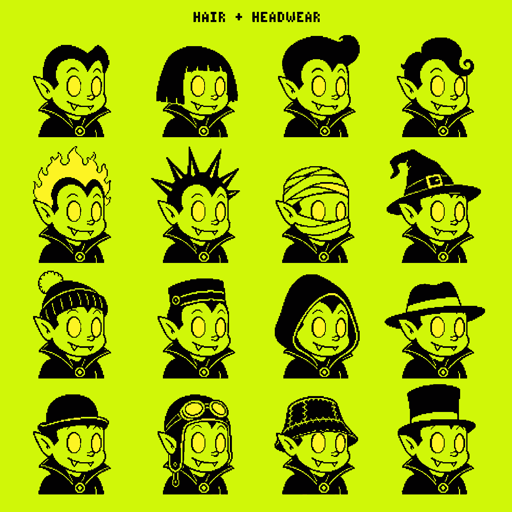
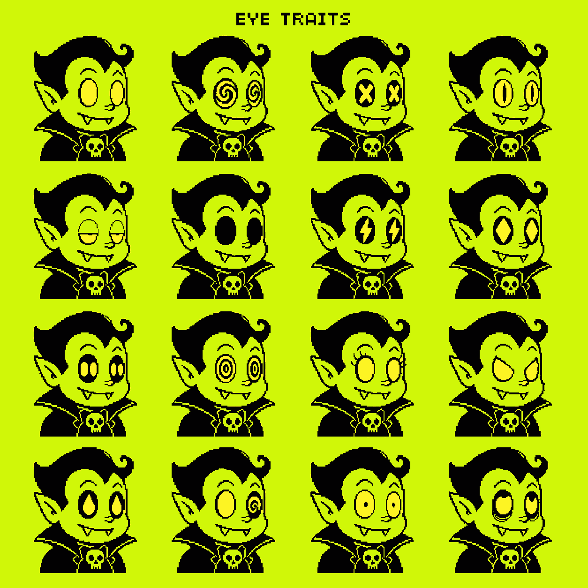
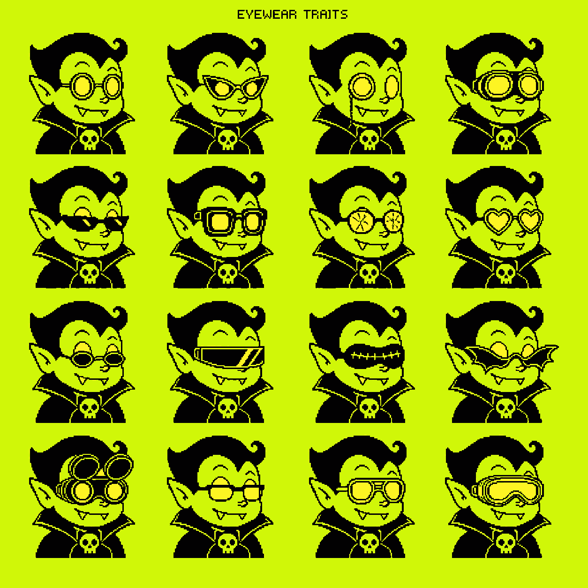
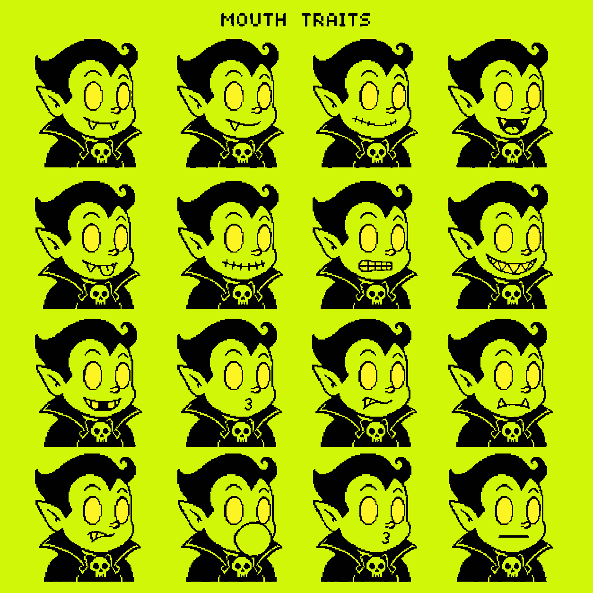
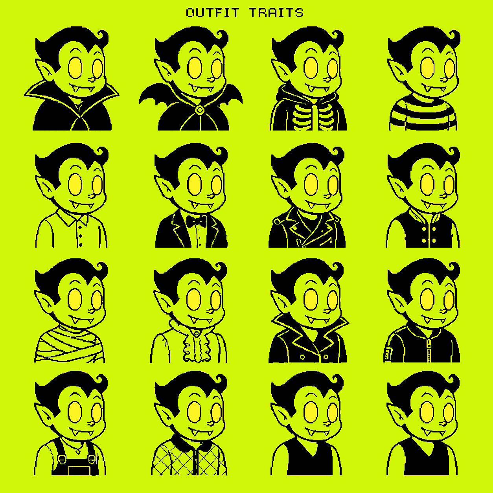
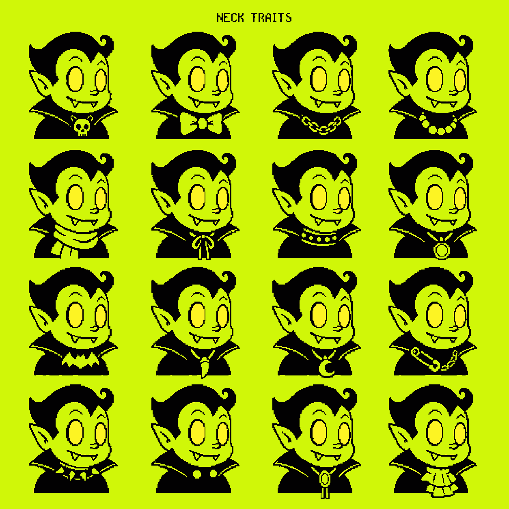
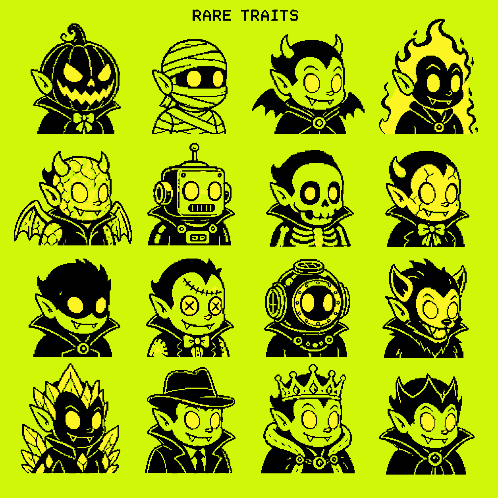
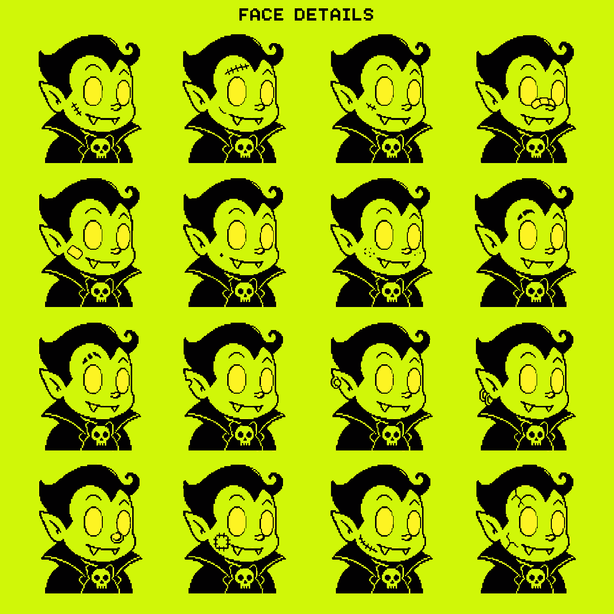

# Neon Nocturne — Trait Expansion V2

Status: **concept review only**. Nothing in this folder is published to the live gallery or treated as a production layer.

These eight sheets contain 128 proposed traits. Cells are numbered left-to-right, top-to-bottom. The restored Neon Nocturne masters remain the sole approved source for final anatomy and linework.

Open `index.html` through a local web server to filter the 128 cards, record approve/revise/reject decisions, and export the decisions as JSON. `cards-transparent/` contains transparent concept previews only; `cards-source/` and `raw-sheets/` are internal drawing references.

Automatic crop/splice production was tested and rejected because it altered eye anatomy and introduced face seams. Final production layers must be redrawn against the locked master geometry.

## Locked production rules

- Preserve the approved three-quarter vampire face, pointed-ear construction, fang placement, head-to-body ratio, shoulder width, and bottom baseline.
- Final layers use only `#020102` ink and `#fdf423` yellow with binary alpha on a transparent 1024×1024 canvas.
- All eye interiors and every flame interior are solid `#fdf423`, with hard edges and no glow, blur, feathering, gradients, or antialiasing.
- No crosses, crucifixes, religious symbols, pentagrams, floating icons, background creatures, grid lines, graph-like blocks, scan lines, or decorative background objects.
- Every approved concept must be redrawn as an independent aligned layer. The concept sheets themselves are not source layers.

## 01 — Hair + Headwear

| Cell | Trait | Cell | Trait |
|---:|---|---:|---|
| 01 | Widow-Peak Wave | 09 | Ribbed Pom Beanie |
| 02 | Blunt Bob | 10 | Bellhop Cap |
| 03 | Pompadour | 11 | Deep Hood |
| 04 | Asymmetric Curl | 12 | Wide Fedora |
| 05 | Living Flame | 13 | Bowler Hat |
| 06 | Needle Spikes | 14 | Aviator Cap |
| 07 | Mummy Wraps | 15 | Stitched Bucket Hat |
| 08 | Crooked Witch Hat | 16 | Stovepipe Hat |

## 02 — Eyes

| Cell | Trait | Cell | Trait |
|---:|---|---:|---|
| 01 | Classic Oval Glow | 09 | Double Pupils |
| 02 | Spiral Pupils | 10 | Hypnotic Rings |
| 03 | Stitched X Pupils | 11 | Dramatic Lashes |
| 04 | Narrow Slits | 12 | Angry Glow |
| 05 | Sleepy Half-Lids | 13 | Teardrop Pupils |
| 06 | Heavy Shadow | 14 | Mismatched Pupils |
| 07 | Lightning Pupils | 15 | Wide Startled |
| 08 | Diamond Pupils | 16 | Tired Under-Eye Ink |

## 03 — Eyewear

| Cell | Trait | Cell | Trait |
|---:|---|---:|---|
| 01 | Round Spectacles | 09 | Tiny Oval Shades |
| 02 | Cat-Eye Glasses | 10 | Wraparound Visor |
| 03 | Monocle | 11 | Stitched Eye Mask |
| 04 | Aviator Goggles | 12 | Bat-Wing Frames |
| 05 | Narrow Shades | 13 | Flip-Up Welding Goggles |
| 06 | Oversized Square Glasses | 14 | Half-Rim Glasses |
| 07 | Cracked Lenses | 15 | Double-Bridge Glasses |
| 08 | Heart Frames | 16 | Safety Goggles |

## 04 — Mouths

| Cell | Trait | Cell | Trait |
|---:|---|---:|---|
| 01 | Twin-Fang Smile | 09 | Missing-Fang Smile |
| 02 | Single-Fang Smirk | 10 | Tiny Pout |
| 03 | Closed Crooked Grin | 11 | Side Bite |
| 04 | Open Fang Laugh | 12 | Underbite Fangs |
| 05 | Tongue-Out Grin | 13 | Upper-Lip Curl |
| 06 | Stitched Lips | 14 | Bubble Gum |
| 07 | Nervous Teeth | 15 | Whistle Mouth |
| 08 | Sharp-Tooth Grin | 16 | Deadpan Line |

## 05 — Outfits

| Cell | Trait | Cell | Trait |
|---:|---|---:|---|
| 01 | Classic High Cape | 09 | Mummy Tunic |
| 02 | Winged Cape | 10 | Victorian Ruffle Blouse |
| 03 | Skeleton Hoodie | 11 | Trench-Coat Collar |
| 04 | Striped Sweater | 12 | Bomber Jacket |
| 05 | Buttoned School Shirt | 13 | Mechanic Overalls |
| 06 | Tuxedo + Bow Tie | 14 | Quilted Night Jacket |
| 07 | Leather Moto Jacket | 15 | Plain Sleeveless Vest |
| 08 | Varsity Jacket | 16 | Deep V Vest |

## 06 — Neck + Chest

| Cell | Trait | Cell | Trait |
|---:|---|---:|---|
| 01 | Skull Clasp | 09 | Bat Brooch |
| 02 | Oversized Bow Tie | 10 | Fang Pendant |
| 03 | Linked Chain | 11 | Crescent Pendant |
| 04 | Round Beads | 12 | Safety-Pin Chain |
| 05 | Wrapped Scarf | 13 | Short Spike Collar |
| 06 | Thin Ribbon | 14 | Twin Collar Studs |
| 07 | Studded Choker | 15 | Bolo Tie |
| 08 | Circular Medallion | 16 | Layered Cravat |

## 07 — Rare Transformations

| Cell | Trait | Cell | Trait |
|---:|---|---:|---|
| 01 | Carved Pumpkin Head | 09 | Shadow Mask |
| 02 | Full Mummy | 10 | Stitched Rag Doll |
| 03 | Horned Bat Cape | 11 | Deep-Sea Helmet |
| 04 | Spectral Flame | 12 | Were-Bat |
| 05 | Stone Gargoyle | 13 | Ice Crystal |
| 06 | Retro Robot | 14 | Noir Detective |
| 07 | Exposed Skeleton | 15 | Night Monarch |
| 08 | Cracked Porcelain | 16 | Crowned Crest |

## 08 — Face Details

| Cell | Trait | Cell | Trait |
|---:|---|---:|---|
| 01 | Cheek Scar | 09 | Double Brow Notch |
| 02 | Forehead Stitches | 10 | Ear Notch |
| 03 | Under-Eye Stitch | 11 | Ear Cuff |
| 04 | Nose Bandage | 12 | Double Earring |
| 05 | Cheek Bandage | 13 | Nose Ring |
| 06 | Beauty Mark | 14 | Cheek Patch |
| 07 | Sparse Freckles | 15 | Jaw Stitch |
| 08 | Single Brow Notch | 16 | Cracked Skin |

## Approval notation

Use `sheet.cell`, for example `02.07` for Lightning Pupils or `07.11` for Deep-Sea Helmet. Traits can be marked approve, revise, or reject before production-layer drawing begins.
